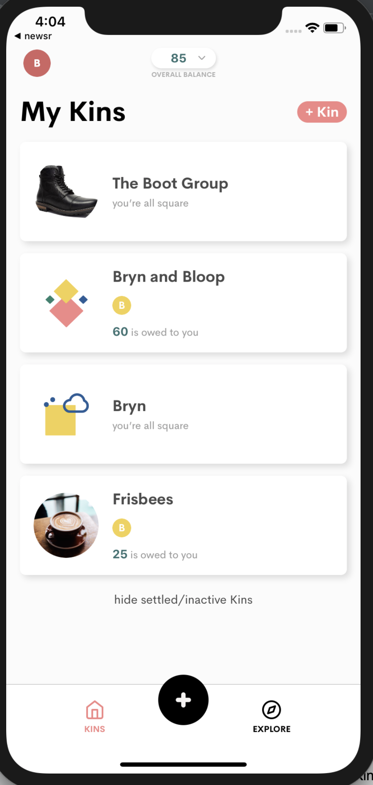

# Kin Hiring Interview - iOS #

The attached Swift iOS application is a hack-job pieced together by a
programmer who has never worked with Swift and has never written a
mobile app. It currently queries a JSON news API with a hardcoded
topic and just lists the titles. It's also constructed as badly as
possible. Your task is to fix it up and make it functional - a
properly scrolling list of news headlines related to the keywords,
with their associated images displayed.

We don't expect you to spend more that two or three hours on this -
which is how long our on-site technical interviews take. But,
obviously, you can if you want to!

## Tasks ##

### Clean up the code ###

The code as it stands is all stuck into a single controller. Refactor
it to be more modular, separate data from view, and fix the bugs.

### Add topic selection ###

Currently the news topic is hardcoded to "swift" - which finds a lot
more about Taylor Swift than it does about the programming
language. We should add the ability to add multiple topics and then
get back news articles related to any of the topics. The documentation
for the API is available
[here](https://newsapi.org/docs/endpoints/everything). It's up to you
how you'd like to do the UI, but a simple text entry field is sufficient.

### Make it prettier ###

You can do anything you like here, design-wise. All we ask is that you
include the article image somehow. If you're all out of inspiration,
just use the rounded, shadowed listing style from our app:

## Stretch goals ##

If you blazed through the above, here are some things that could be
added:

- tests, unit and UI
- a "swipe right to hide, left to highlight" functionality that hides
  or pins a particular article, storing the URLs on the phone so that
  they persist over restarts
- paging
- click-through to the article itself
- anything else you want to do to show off your skills

